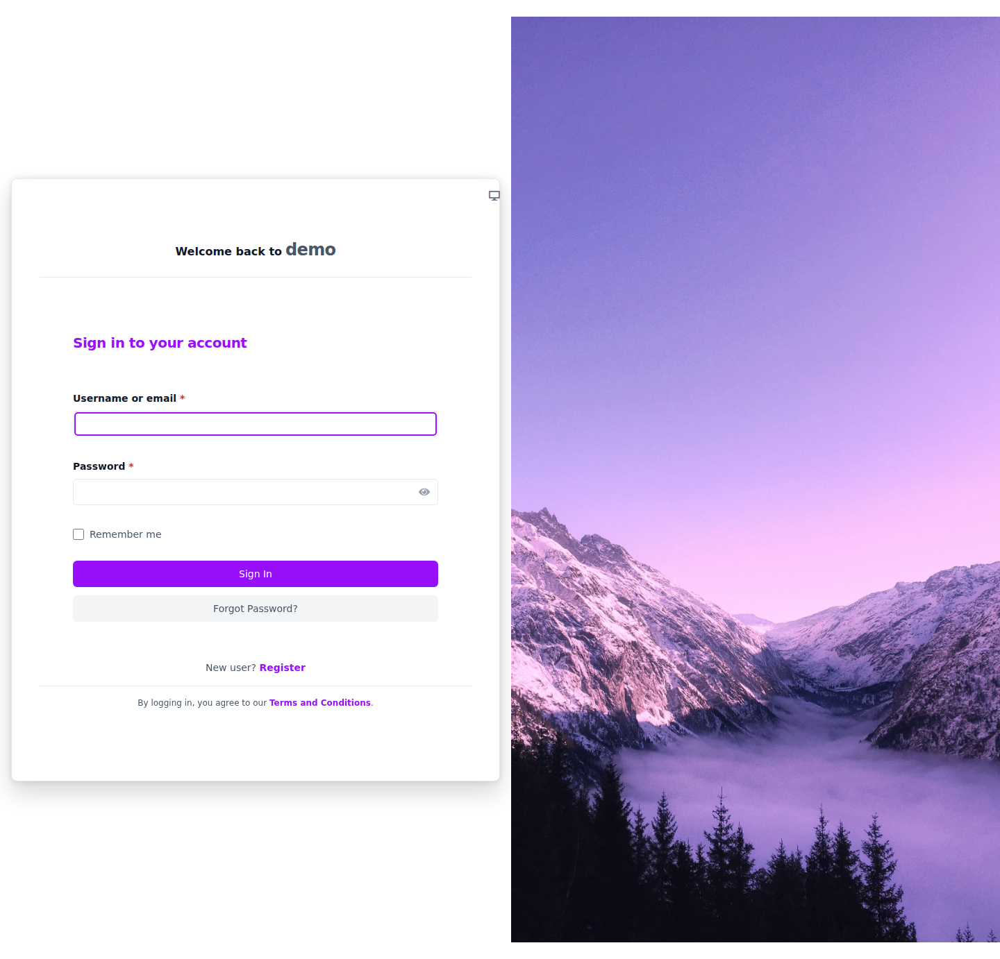
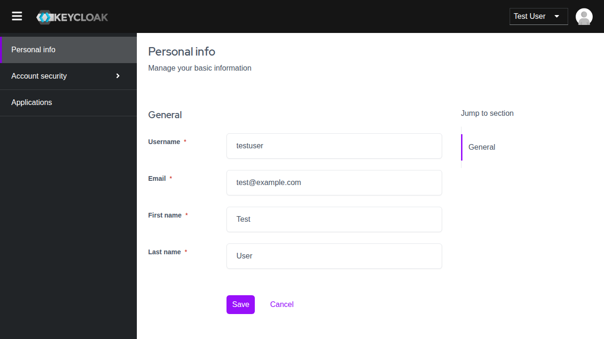

# keycloak-unfold-theme

> **Disclaimer**: This project is experimentally written almost entirely by AI. Any usage of this software should keep this in mind, and the execution of this software is at your own risk.

This repository contains a custom Keycloak theme designed to resemble the Tailwind-based 'Unfold' theme. Theme customization is achieved by extending standard Keycloak themes (such as `keycloak.v2`, `keycloak.v3`, and `base`) and overriding PatternFly 5 (`--pf-v5-*`) CSS variables.

## Local Development

Local development and demonstration rely on Docker Compose to run a Keycloak instance with a pre-configured demo realm.

To start the Keycloak instance, run:

```bash
docker compose up
```

Keycloak will be accessible at `http://localhost:8080`.
The default admin credentials are:
* **Username:** `admin`
* **Password:** `admin`

You can view the specific demo login pages using the following links (login with username `testuser` and password `password`):
* **Centered Theme Demo:** [http://localhost:8080/realms/Unfold-Centered-Demo/account/](http://localhost:8080/realms/Unfold-Centered-Demo/account/)
* **Split Theme Demo:** [http://localhost:8080/realms/Unfold-Split-Demo/account/](http://localhost:8080/realms/Unfold-Split-Demo/account/)

## Testing

UI testing is implemented using Playwright.

To execute the tests, install the dependencies and run:

```bash
npm install
npx playwright test
```

## Screenshots

### Login Page


### Keycloak Admin Console


## Credits

This project is inspired by the excellent [Django Unfold Theme](https://github.com/unfoldadmin/django-unfold).
