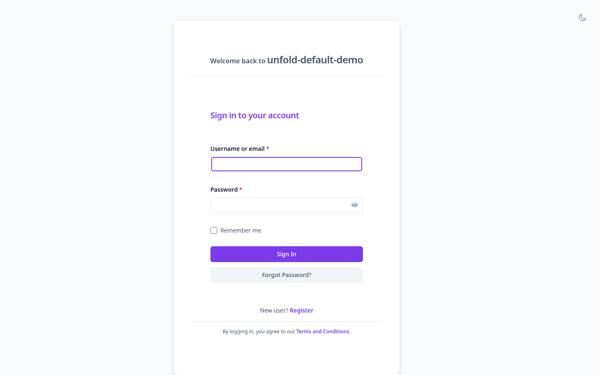
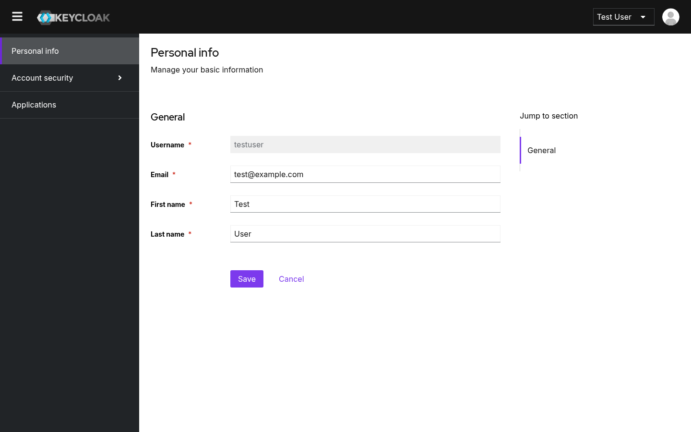
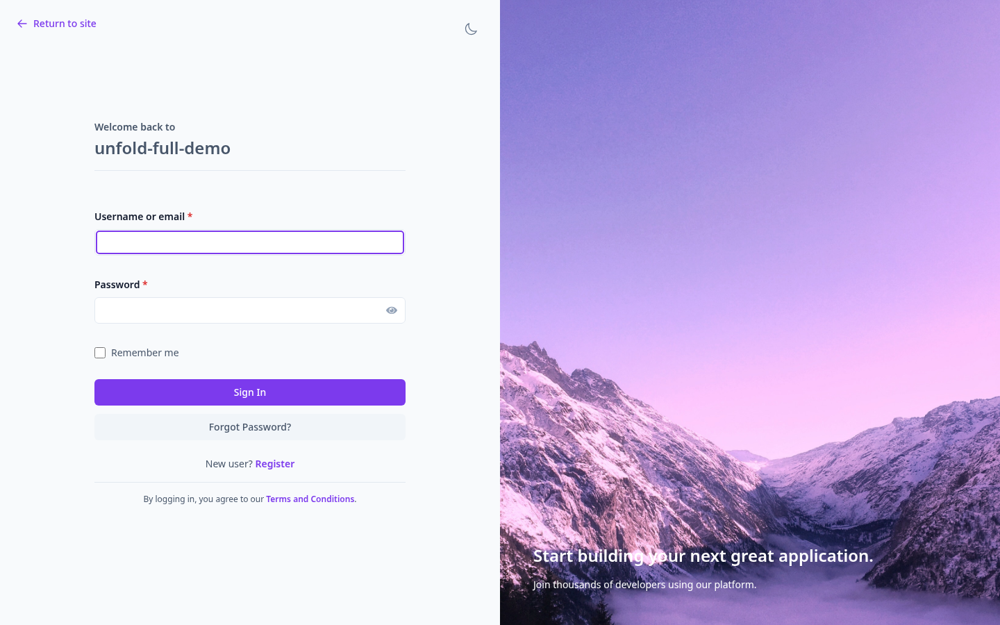
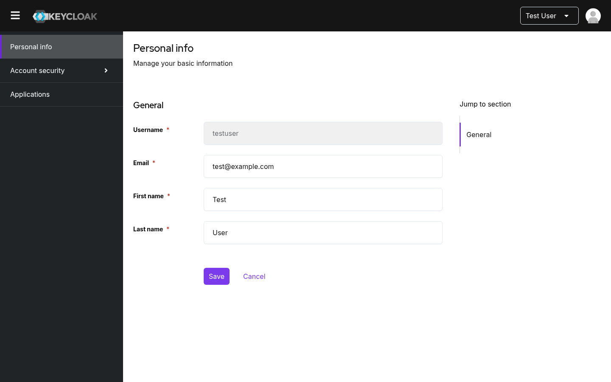

# keycloak-unfold-theme

> **Disclaimer**: This project is experimentally written almost entirely by AI. Any usage of this software should keep this in mind, and the execution of this software is at your own risk.

This repository contains a modular Keycloak theme designed to emulate the aesthetics of the [Django Unfold Theme](https://github.com/unfoldadmin/django-unfold). It focuses on a clean, modern interface by extending Keycloak's `v2` theme and overriding PatternFly 5 CSS variables.

## Theme Variants

- **`unfold-default`**: A simple login layout with a centered container. The Admin and Account consoles are kept close to the standard Keycloak look, modified only with the Unfold accent colors and typography.
- **`unfold-full`**: A modern login layout with a split-screen background image. The Admin and Account consoles feature additional styling like rounded corners and subtle shadows for a more distinct "Unfold" experience.

## Local Development

Local development and demonstration rely on Docker Compose to run a Keycloak instance with pre-configured demo realms.

To start the Keycloak instance, run:

```bash
docker compose up
```

Keycloak will be accessible at `http://localhost:8080`.
The default admin credentials are:
* **Username:** `admin`
* **Password:** `admin`

You can view the specific demo login pages using the following links (login with username `testuser` and password `password`):
* **Default Theme Demo:** [http://localhost:8080/realms/unfold-default-demo/account/](http://localhost:8080/realms/unfold-default-demo/account/)
* **Full Theme Demo:** [http://localhost:8080/realms/unfold-full-demo/account/](http://localhost:8080/realms/unfold-full-demo/account/)

## Testing

UI testing is implemented using Playwright.

To execute the tests, install the dependencies and run:

```bash
npm install
npx playwright test
```

## Screenshots

### Unfold Default
The `unfold-default` variant focuses on a clean, "Keycloak-native" feel with custom accent colors.

**Login Page**


**Account Console**


### Unfold Full
The `unfold-full` variant provides a more customized, high-aesthetic experience.

**Login Page**


**Account Console**


## Credits

This project is inspired by the excellent [Django Unfold Theme](https://github.com/unfoldadmin/django-unfold).
